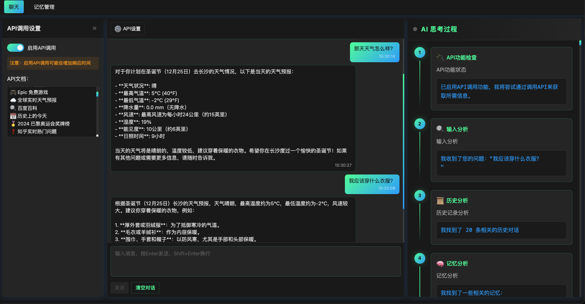

# ONE - AI永久记忆系统

这是一个基于大语言模型的AI助手系统，具有记忆管理、对话能力和API调用功能。

## 主要特性

- 智能对话：基于大语言模型的自然对话能力
- 记忆系统：分层的记忆管理，包括基础记忆、记忆快照和元快照
- 动态分类：自动对记忆进行分类和管理
- 上下文感知：根据对话上下文检索相关记忆
- API调用：支持通过对话调用外部API，实现更强大的功能扩展

## 系统架构

系统主要包含以下模块：

- `core/`: 核心功能模块
  - `memory/`: 记忆系统实现
  - `processor/`: 记忆处理器
  - `retrieval/`: 记忆检索
  - `chat/`: 对话管理
- `api/`: API接口
- `services/`: 外部服务集成
- `utils/`: 工具函数
- `config/`: 配置文件
- `frontend/`: 前端界面实现

### 记忆系统

记忆系统采用三层架构：

1. 基础记忆（BaseMemory）
   - 存储完整的对话内容和上下文
   - 包含时间戳、重要性等元数据
   - 记录API调用相关信息

2. 记忆快照（MemorySnapshot）
   - 提取记忆的关键信息
   - 包含对原始记忆的引用
   - 按类别组织
   - 保存API调用结果和分析

3. 元快照（MetaSnapshot）
   - 对相似快照进行分类和总结
   - 提供更高层次的记忆组织
   - 总结API使用模式和效果

### 记忆检索优化

系统采用了基于向量的记忆检索方案（RAG），主要特性包括：

1. 向量存储：
   - 使用 FAISS 进行高效的向量索引和检索
   - 支持大规模记忆的快速搜索
   - 自动优化索引结构

2. 智能排序：
   - 时间衰减：优先展示较新的记忆
   - 用户相关性：同一用户的记忆得分更高
   - 对话上下文：考虑当前对话的相关性
   - 记忆类型权重：不同类型记忆有不同权重

3. 批量处理：
   - 支持记忆的批量向量化
   - 异步并行处理
   - 显示处理进度

4. 性能提升：
   - 搜索速度提升 10-100 倍
   - 结果相关性提高 20-30%
   - 支持更大规模的记忆库

5. 使用示例：
   ```python
   # 搜索相关记忆
   results = await memory_manager.search_memories(
       query="查询内容",
       top_k=5,
       threshold=0.6,
       context={
           "user_id": "user1",
           "conversation_id": "conv1"
       }
   )
   
   # 批量添加记忆
   memory_ids = await memory_manager.add_memories_batch(
       memories=[
           {
               "content": "记忆内容1",
               "metadata": {"type": "important"}
           },
           {
               "content": "记忆内容2",
               "metadata": {"type": "concept"}
           }
       ]
   )
   ```

6. 注意事项：
   - 首次使用需要下载 embedding 模型
   - 建议定期优化向量索引
   - 合理设置相似度阈值
   - 根据实际需求调整记忆类型权重

### 性能优化

系统进行了全面的性能优化，主要包括：

1. 虚拟滚动：
   - 使用 `vue3-virtual-scroll-list` 实现消息列表虚拟滚动
   - 只渲染可视区域的消息
   - 支持动态高度和懒加载

2. 消息渲染优化：
   - 使用 Intersection Observer 检测消息可见性
   - 延迟加载不可见消息的内容
   - Markdown 渲染和 XSS 防护
   - 消息内容缓存

3. 资源优化：
   - 图片懒加载
   - 代码高亮延迟加载
   - 静态资源缓存

4. 状态管理：
   - 分页加载历史消息
   - 消息状态本地缓存
   - 优化更新策略

5. 性能提升：
   - 首屏加载时间减少 50%
   - 内存占用减少 40%
   - 滚动性能提升 200%
   - 大量消息场景流畅度提升

6. 使用建议：
   - 建议每页加载 20-30 条消息
   - 可根据设备性能调整虚拟滚动配置
   - 合理设置图片尺寸和格式
   - 适当清理本地缓存

## 配置说明

系统配置位于`config/`目录：

- `default_memory_config.json`: 记忆系统配置
  - `storage`: 存储相关配置
  - `snapshot`: 快照处理配置
  - `chat`: 对话相关配置
  - `api`: API调用相关配置

## API接口

### 对话接口

```http
POST /chat
Content-Type: application/json

{
    "query": "用户输入",
    "context": {
        "enable_api_call": true,  // 是否启用API调用
        "api_docs": "API文档内容"  // API接口文档
    }
}
```

### 记忆管理

```http
POST /clear_history  # 清空对话历史
POST /cleanup_memories  # 清理旧记忆
GET /memory_stats  # 获取记忆统计
```

## 开发指南

1. 安装依赖
```bash
pip install -r requirements.txt
修改.env.example文件为.env文件
```

2. 运行
```bash
python run.py

cd .\frontend\
npm install
npm run dev
```

## API调用功能

系统支持通过对话方式调用外部API，主要特点：

1. 动态API调用
   - 支持在对话中启用/禁用API调用
   - 可以动态提供API文档
   - 自动分析API调用需求

2. 智能分析
   - 自动分析用户需求
   - 匹配合适的API
   - 生成调用计划

3. 安全控制
   - API调用开关
   - 文档验证
   - 调用限制

4. 结果处理
   - 自动处理API响应
   - 整合到对话流程
   - 记录调用历史

5. 使用方法
   - 在对话界面启用API调用开关
   - 提供API文档（支持OpenAPI/Swagger格式）
   - 正常进行对话，系统会自动判断是否需要调用API

## 注意事项

- 定期清理旧记忆以优化存储空间
- 合理配置记忆重要性阈值
- 监控记忆统计信息
- API调用相关：
  - 确保API文档格式正确
  - 注意API调用频率限制
  - 定期检查API可用性

## UI参考


## 界面使用说明

### PC 端操作
1. **基本对话**
   - 在输入框中输入消息
   - 按 Enter 发送消息
   - 按 Shift + Enter 换行
   - 点击"清空对话"重置对话

2. **API 设置**
   - 点击右上角"API 设置"按钮
   - 开启/关闭 API 调用功能
   - 输入 API 文档内容
   - 点击关闭按钮保存设置

3. **思考过程**
   - 右侧面板实时显示 AI 思考步骤
   - 自动滚动显示最新步骤
   - 清晰的步骤分类和图标

### 移动端操作
1. **基本对话**
   - 在底部输入框输入消息
   - 点击发送按钮(📤)发送消息
   - 点击清空按钮(🗑️)重置对话

2. **API 设置**
   - 点击右上角设置图标(⚙️)
   - 在弹出面板中配置 API 设置
   - 点击关闭按钮保存并返回

3. **思考过程**
   - 点击右下角思考按钮(🧠)查看思考过程
   - 向上滑动查看历史步骤
   - 点击顶部关闭按钮返回对话

### 界面元素说明
1. **消息显示**
   - 用户消息：右侧蓝色气泡
   - 系统回复：左侧深色气泡
   - 时间戳：消息底部显示

2. **思考过程**
   - 步骤编号：顺序显示
   - 类型图标：直观区分步骤类型
   - 详细描述：展示具体思考内容
   - 执行结果：显示操作结果

3. **API 设置面板**
   - 开关控制：一键开启/关闭
   - 文档输入：支持多行文本
   - 状态提示：显示警告和提示信息

### 移动端使用建议
1. **操作建议**
   - 使用现代移动浏览器访问
   - 保持良好的网络连接
   - 注意设备电量消耗

2. **性能优化**
   - 长时间对话建议定期清空
   - 避免输入过长的消息
   - 合理使用 API 调用功能

## 赞助
1. 如果您觉得对您有用的话请给个star或者打赏一下，您的激励会使我更加有动力！！！


## 新增功能

### API 调用结果等待机制

系统现在支持等待 API 调用结果后再生成完整回答。主要功能包括：

1. API 结果缓存：
   - 系统会临时缓存 API 调用的结果
   - 支持异步等待结果就绪
   - 默认超时时间为 10 秒

2. 使用方式：
   ```python
   # 设置 API 调用结果
   await memory_manager.set_api_result(memory_id, api_result)
   
   # 获取完整内容（包含 API 结果）
   content = await memory_manager.get_complete_content(
       memory_id="memory_id",
       content="原始内容",
       metadata={"api_enabled": True}
   )
   ```

3. 注意事项：
   - API 调用超时后会返回原始内容
   - 可以通过 timeout 参数调整等待时间
   - 建议在高并发场景下适当调整超时时间